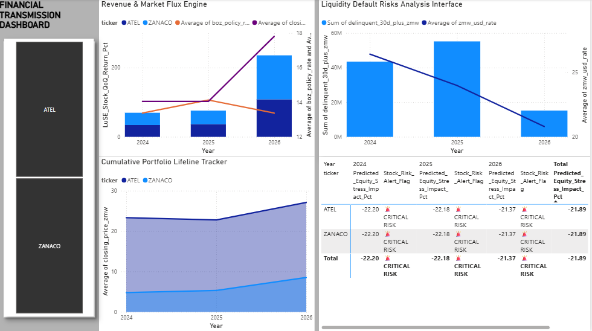
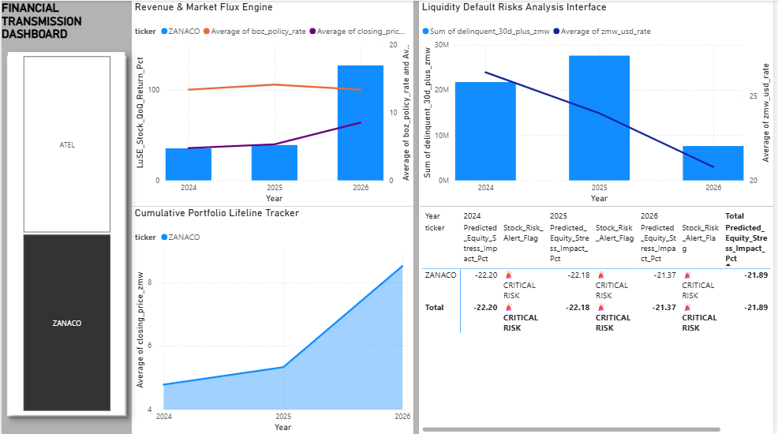
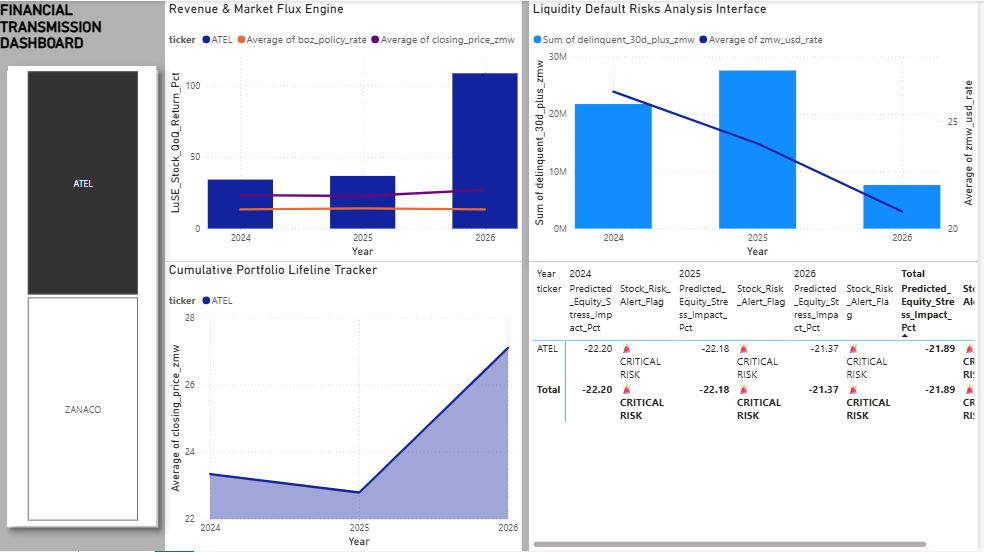

# Zambian-Macro-to-Micro-Transmission-Engine
An interactive macroeconomic stress-testing dashboard mapping Bank of Zambia interest rate transmission lags to LuSE equities and Optasia fintech default risk.

The Zambian Macro-to-Micro Transmission Engine is an interactive macroeconomic analytics pipeline and dashboard tailored to the Zambian financial ecosystem. This project links monetary policy adjustments from the Bank of Zambia (BoZ) with Lusaka Securities Exchange (LuSE) equities and high-frequency digital financial credit books (replicating an Optasia-style fintech platform).

                                                                                    

Executive Project Summary

This project models how central bank policy adjustments pass through the economy to affect consumer credit and public markets. Operating on a high-precision timeline running from 2024 to mid-2026, the project uncovers a crucial predictive relationship: consumer default risks on mobile money platforms act as a leading indicator for public equities, shifting exactly one quarter (90 days) ahead of the stock market.
When macro variables tighten, everyday consumers deplete their personal cash buffers within 90 days. This asset squeeze triggers a wave of micro-defaults on mobile credit books before surfacing as formal corporate impairments on commercial bank balance sheets.

Core Visualizations & Questions Answered

Q1: Revenue & Market Flux Engine (Top Left Chart)

Tracks the financial relationship between the Bank of Zambia (BoZ) interest rates and public stock prices over the 2024–2026 timeline. It follows a predictable 3-step cycle:

The Profit Boost: Early rate hikes expand net interest margins for commercial banks, driving up stock prices and creating positive growth velocity bars (LuSE_Stock_QoQ_Return_Pct).                                                                                                                 
The Sweet Spot: The point where the rising interest rate line meets the climbing stock price line marks peak near-term corporate earnings.         
The Squeeze: If interest rates stay too high for too long, bad debts pile up, bank profits crash, the stock price line plunges, and growth bars flip into the negative zone.

Q2: Cumulative Portfolio Lifeline Tracker (Bottom Left Chart)

Maps the explicit journey of a stock investment block over the high-precision 2024 to 2026 window, showing how its value evolves through three distinct macro phases over time:

-Phase 1: Accumulation (Early 2024): The Bank of Zambia policy rate sits at a manageable 12.50% and the Kwacha trades around 25.40 ZMW/USD. This is a stable entry window. ZANACO is cheap (K4.10) and Airtel is steady (K22.00) because consumer default risks are low.                              
-Phase 2: Peak Margin Squeeze (Mid-2024 to 2025): The central bank aggressively hikes interest rates to 14.00% and 14.50% to fight inflation. While this creates a cash crunch for consumers, it temporarily maximizes bank lending revenues, causing ZANACO’s stock to peak at K5.20. Concurrently, Airtel's stock drops to K21.50 due to rising corporate debt-servicing costs. By 2025, consumer financial buffers empty completely, causing mobile money default columns to spike to their highest levels.                                                                                         
-Phase 3: Recovery Breakout (2026): Inflation drops to single digits, and the Bank of Zambia safely reduces the policy rate down to 13.25%, while the Kwacha strengthens below 21.00 ZMW/USD. Consumer wallet risk drops, debt servicing costs fall, and both stocks enter a massive breakout rally—with ZANACO climbing to K9.54 and Airtel breaking out to K28.20.

Q3: Liquidity Default Risks Analysis Interface (Top right Chart)

Captures a vital economic trend: Exchange rate volatility is the primary trigger for consumer loan defaults.
When the zmw_usd_rate line spikes (a weakening Kwacha), it drives up the local price of imported essentials like fuel and food.
Everyday mobile wallet users instantly face imported inflation, forcing them to exhaust their cash savings.
Unable to manage their obligations, users stop paying back short-term micro-loans, causing delinquency column bars (delinquent_30d_plus_zmw) to expand rapidly.

ZANACO
                                                                                                                                                                                                                                                                                                                                                                            
ATEL                                                                                                                                      
                                                                                           

Technical Solution Architecture

The solution uses a three-tier architecture: SQL (pgAdmin) for core data engineering, Python for automated server connectivity and time-lag feature engineering, and Power BI (DAX) for interactive risk visualizations.                                                                       
[ PostgreSQL DB ] ──► [ Python ETL Engine ] ──► [ Upgraded CSV ] ──► [ Power BI Canvas ]                                                           
 (Raw Macro/Fintech)   --   (90-Day Lag Mapping)   --    (Production Asset)  --   (Analytical Dashboard)                                                       

1. Database Engineering Layer (schema.sql)
   
Maintains relational tables joined by matching calendar dates to track macroeconomic data points along with corporate metrics.                     
boz_macro_indicators: Tracks Bank of Zambia base rates, price indices, and exchange rates.                                                         
luse_stock_portfolio: Tracks closing share prices for listed assets like ZANACO (banking) and Airtel Zambia (telecom infrastructure).              
optasia_replicated_loan_book: Holds mobile money nano-loan records, tracking total credit issuance and consumer delinquencies.

2. Computational Pipeline Layer (transimission_engine_pipeline.py)
   
Uses SQLAlchemy to open a server pipeline directly to pgAdmin. It extracts raw data, computes consumer non-performing loan (NPL) ratios, and executes a .shift(1) algorithm to map the 90-day macroeconomic transmission time-lag. The output exports as a single dataset: financial_zambian_data.csv.

3. Interactive Analytics Layer (Power BI Desktop)

Ingests the production CSV file through an active data gateway to feed custom, high-precision DAX metrics:                                         
Quarterly Stock Return Velocity: LuSE_Stock_QoQ_Return_Pct                                                                                         
Forward Predictive Stress Engine: Predicted_Equity_Stress_Impact_Pct (Applies compounded penalties to equity valuations if the Kwacha depreciates past 25.00 ZMW/USD or lagged policy rates spike).                                                                                                  
Automated Risk Sentry Boundary: Stock_Risk_Alert_Flag (Flags an automated 🚨 CRITICAL RISK warning the moment a stock's projected value destruction crosses a -15% threshold).

How to Run This Project

Database Setup: Open pgAdmin, create a database named zambian_finance, and execute the text contents of schema.sql inside your query tool to seed the core data.                                                                                                                                     
Execute Pipeline: Configure your database server credentials inside trasmission_engine_pipeline.py and run the script to output the compiled production dataset file (financial_zambian_data.csv).                                                                                              
Launch Workspace Dashboard: Open Financial_Transmission_Dashboard.pbix in Power BI Desktop, click Refresh on the top toolbar to map the CSV table asset, and use the interactive left-hand Ticker Slicer panel to view the live transmission models.                                                 
